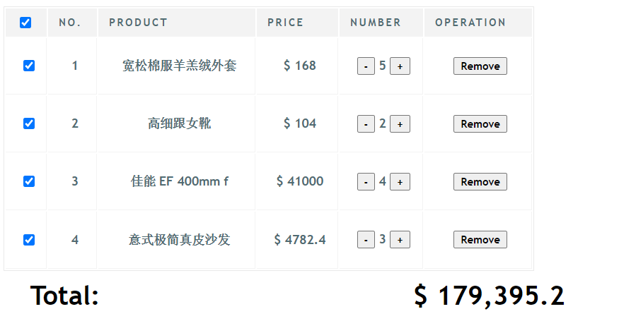
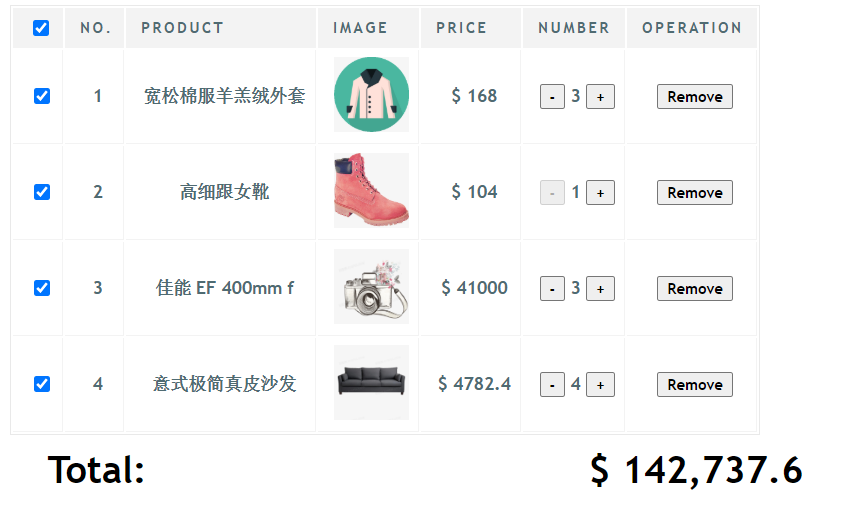

# 
Homework II Shopping Cart

[TOC]

## Introduction & demo
### Introduction
- 购物车示例
    1. 展示订单列表
    2. 点击加减 数量
        2.1 加减数量 会要去重新计算 totalprice
    3. 移除item
        3.1 移除 item 会重新计算 totalprice
- demo 展示
    + version 1.0

    + version 2.0

## Technology
> VUE Frame  
> https://cdn.jsdelivr.net/npm/vue/dist/vue.js

## Reference
1. 图片引用：
> http://616pic.com/

2. 图片插入问题借鉴
> https://github.com/kaeyleo/vue-shopping-cart
